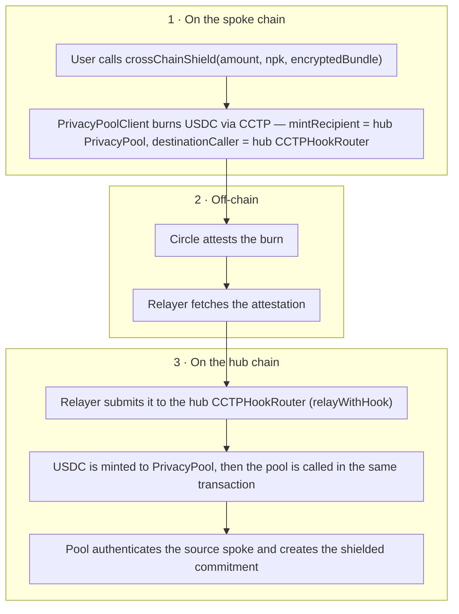
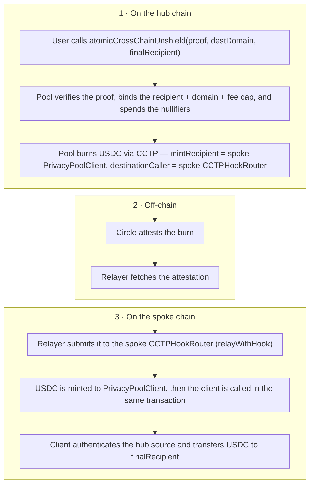

# Cross-chain flow

USDC enters and leaves the shielded pool from multiple chains. The transport is
[Circle's CCTP](https://www.circle.com/cross-chain-transfer-protocol) — a burn-and-mint protocol:
USDC is burned on the source chain, Circle's attestation service signs a message attesting to the
burn, and that message is used to mint an equal amount of native USDC on the destination chain.

Armada uses CCTP's **hooked** transfer: the burn carries a small `hookData` payload, and delivery
runs through a `CCTPHookRouter` that mints the USDC and then calls the destination contract in the
same transaction. That is what lets a bridged deposit land as a shielded commitment atomically.

## Shielding from a spoke

The spoke burns the user's USDC with the deposit details attached, and pins the delivery so the
message can only be minted to the hub pool and only executed by the hub's hook router. Circle's
attestation service signs the burn off-chain; a relayer fetches that attestation and submits it to
the hub, where the USDC is minted to the pool and — in the same transaction — the pool checks the
message came from a spoke it trusts and creates the shielded commitment. The user ends up with a
private balance in the pool. (The burn and the mint are two separate transactions on two chains,
bridged by the off-chain attestation — not one synchronous call.)

## Unshielding to a spoke

An unshield to another chain is proven and burned on the hub in one atomic operation. The proof
**binds the destination** — the recipient, destination domain, and fee cap are committed into the
proof — so the burn cannot be re-aimed at a different recipient after the fact. On the spoke, the
client checks the message came from the hub pool and delivers native USDC to the recipient.

## What the cross-chain message carries

This is important for understanding Armada's privacy model. The CCTP message is **mostly
plaintext**. For a cross-chain shield it carries, in the clear: the amount, the recipient's
note-key (`npk`), the shield key, the integrator, and all the routing fields. Only the note's
`encryptedBundle` is encrypted.

In other words, **the privacy boundary begins *after* the bridge.** A cross-chain shield does not
hide the amount or destination note-key while it is in flight; those become private only once value
is a commitment inside the pool and subsequently transferred. On-hub operations (transfers, and the
proving of unshields) are where the zero-knowledge privacy applies. The
[privacy model](/crypto/privacy) covers exactly what is and isn't hidden, and where.

## The trust boundary

The cross-chain path relies on two outside actors — a **relayer** and the **CCTP attestation
service** — neither of which is trusted with user funds or privacy.

**The relayer** carries the attested message and can pay gas. It is a dumb pipe:

- It **cannot alter** the amount, recipient, destination, or payload — the message is signed by
  the attestation, and any tampering fails verification.
- It **cannot steal** the funds — the mint is addressed to the pinned pool contract, never to the
  relayer, and delivery is atomic (if the hooked call reverts, the whole transaction reverts, so
  funds are never stranded mid-flight).
- It **cannot substitute itself** as the caller — the burn pins `destinationCaller` to the correct
  hook router, so only that router can trigger delivery.
- It **cannot read** the private note contents (`encryptedBundle`). It can observe the plaintext
  fields, and it can choose *whether and when* to relay — a liveness consideration, not a safety
  one. If no relayer will serve a user, they can submit the transaction themselves as a last
  resort, but doing so links the operation to their own public address and gives up much of the
  privacy a relayer provides. Self-submitting is a liveness fallback, not a privacy-preserving
  default.

**The attestation service** (Circle) signs the burn message and is trusted for message
authenticity, as it is for any CCTP transfer. Armada adds **defense in depth** on top of it: every
inbound message is checked against a per-domain **source-pool authentication** — the hub only
accepts a shield whose message was sent by a spoke pool it has explicitly recorded, and a spoke
only accepts an unshield whose message came from the hub pool. A message from an unconfigured
domain or an unknown source contract is rejected even if it is validly attested.

## Availability: you can always exit

Because a spoke never holds shielded state, exiting the system is a hub operation. Unshields remain
available even when new shields are paused: the shield-pause control (used by the
[Security Council](/governance/security-council) for emergencies) halts *new shields only* and
auto-expires; it never blocks unshields. The one exception is the single, non-renewable 24-hour
emergency pause available after [wind-down](/wind-down/), which halts all pool operations briefly;
outside that narrow case, users can always withdraw.
