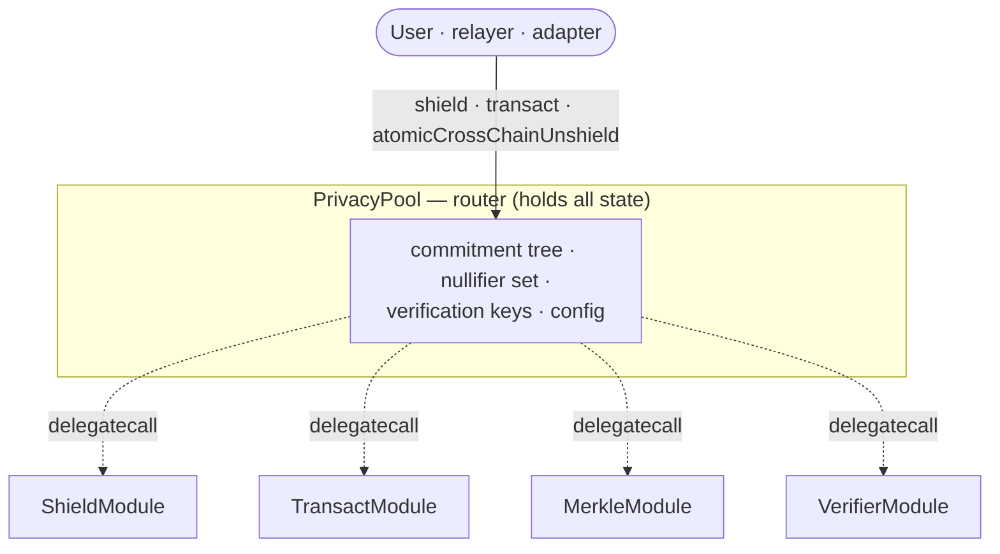

# The PrivacyPool

The `PrivacyPool` on the hub is the shielded pool. It is built as a **router with modules**: one
contract holds all the state, and four modules hold the logic. Everything a user does — shielding,
transferring, unshielding — enters through the router and is dispatched to a module.

## Router and modules

`PrivacyPool` stores **all** shielded state: the commitment tree, the nullifier set, the
verification keys, and the pool's configuration. The four modules contain no state of their own.
The router invokes them with `delegatecall`, so a module's code executes *in the router's storage
context* — it reads and writes the router's state directly.

Because logic runs by `delegatecall`, the modules are never meant to be called directly. Each
module function is guarded so that a **direct** call reverts and only a call *through the router*
succeeds. (Mechanically, each module records its own address at deployment; under `delegatecall`
the executing address is the router, not the module, and the guard keys off that difference.)

The router also wraps its state-changing entry points in a reentrancy guard, and marks nullifiers
before it pays anything out, so a malicious token cannot re-enter mid-operation.

## The four modules

| Module | Responsibility |
|---|---|
| **ShieldModule** | Handles deposits — both local shields and incoming cross-chain shields. Validates the deposit, applies the shield fee, and creates the new commitment(s). |
| **TransactModule** | Handles private transfers and unshields (local and cross-chain). Verifies the proof, spends the input notes' nullifiers, and creates the output commitments. |
| **MerkleModule** | Maintains the commitment tree — inserts new commitment leaves and tracks the tree root history. |
| **VerifierModule** | Holds the verification keys for the zero-knowledge proof system. |

The details of how commitments, nullifiers, and proofs work are covered in
[Cryptography & privacy](/crypto/); the end-to-end operations are in [Core flows](/flows/).

## The modules are immutable

The four module addresses are set **once**, when the pool is initialized, and there is **no
function to change them afterward.** This is deliberate. Two of the modules (`ShieldModule`,
`TransactModule`) hold the fund-custody logic and two (`MerkleModule`, `VerifierModule`) hold the
tree-and-proof logic. If a module could be swapped, whoever could swap it could redirect user funds
or install logic that accepts forged proofs — exactly the trust assumption the design rejects.
Pinning the modules at deployment fixes the custody and verification codepaths for the life of the
pool.

::: warning One nuance
The `VerifierModule` *contract* is immutable, but the verification **keys** it holds remain
settable by the pool owner — a deliberate allowance for rotating circuits and keys. Module
immutability alone therefore does not fully protect proof verification: it pins *which* code
verifies proofs, not *which* key that code trusts. Key custody is part of the ownership model
below.
:::

## What is configurable, and what is not

The pool separates its **immutable core** from a **configurable surface**. The core cannot be
changed after deployment; the configuration can be adjusted by the pool owner.

**Immutable after initialization:**

- the four modules;
- the treasury address that receives protocol fees;
- the CCTP wiring (token messenger, message transmitter, USDC address, local domain).

**Owner-configurable:**

- the shield fee, and the pointer to the fee module that computes fees;
- the shield-pause controller and the hook router;
- the per-domain `remotePools` and `remoteHookRouters` (which spoke pools/routers the hub trusts);
- the default CCTP finality threshold and the token blocklist (USDC can never be blocked);
- the verification keys (via the verifier module);
- the adapter registry pointer — which is **set once** and cannot be repointed afterward.

## Who controls the pool

The configurable surface above is gated to the pool's **owner**, which is governance — the same
[governor and timelock](/governance/) that controls the rest of the protocol. Governance can adjust
the pool's operational configuration — the shield fee, the fee-module pointer, the hook routers, the
trusted remote pools, the token blocklist, the verification keys — through the normal proposal
process.

What governance **cannot** touch is the immutable core: the four modules, the custody and
verification codepaths they contain, and the treasury destination are all fixed at deployment and
beyond the reach of any owner. Configuration is adjustable; the pool's custody and verification are
not.
