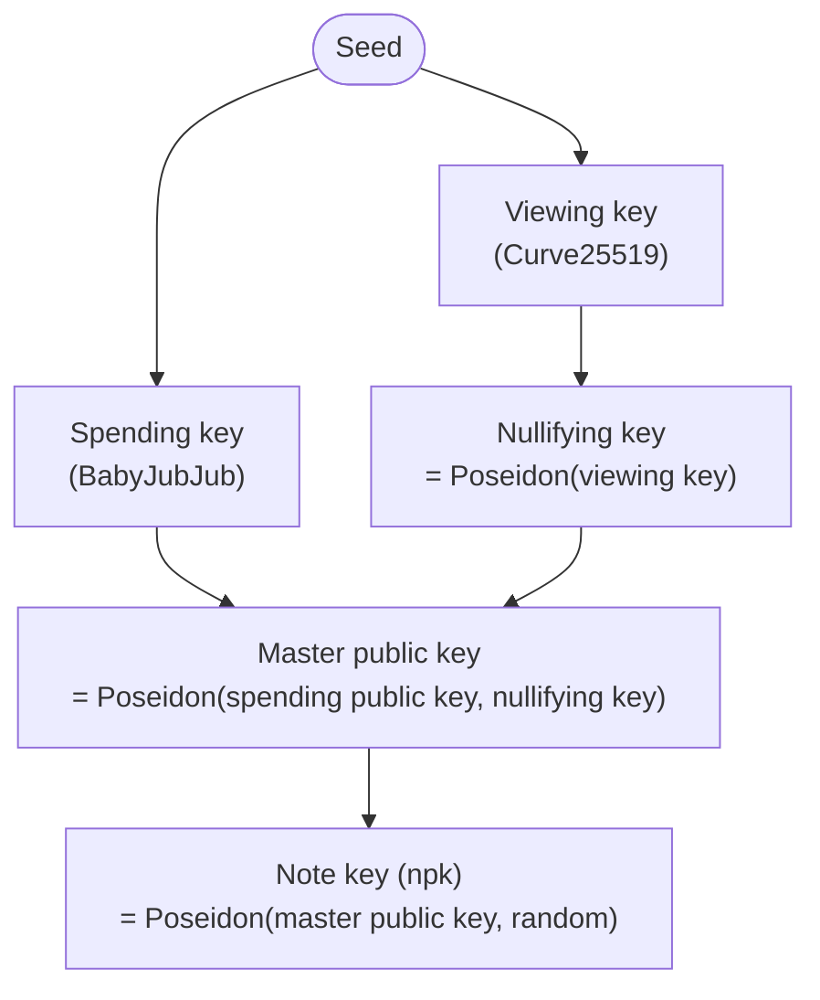

# Notes & the shielded ledger

The shielded pool is built from a small set of cryptographic primitives. This page covers the data
structures — notes, commitments, nullifiers, the commitment tree, and keys. The
[proof system](/crypto/proofs) covers how transactions over them are proven, and the
[privacy model](/crypto/privacy) covers exactly what they hide.

Throughout, the workhorse hash is **Poseidon** — a hash function designed to be efficient to compute
*inside* a zero-knowledge proof, which is what makes private transactions practical.

## Notes and commitments

A **note** is a unit of private value. It records three things: the recipient's **note key**
(`npk`), the **token**, and the **value**. Only the note's owner (and anyone holding their viewing
key) can see those fields.

What the pool actually stores is the note's **commitment** — a Poseidon hash of its contents:

```
commitment = Poseidon(npk, token, value)
```

The commitment is *hiding* (it reveals nothing about the npk, token, or value) and *binding* (none
of them can be changed without producing a different hash). Two notes sent to the same owner still
look unrelated on-chain, because each note's `npk` is freshly randomized (see [Keys](#keys-and-addresses)
below) — so their commitments share nothing.

## The commitment tree

Every commitment ever created is appended to a **Merkle tree** — a binary tree, 16 levels deep, whose
node hash is again Poseidon:

```
parent = Poseidon(left child, right child)
```

The tree's **root** is a single value that summarizes the entire set of commitments. To spend a note,
you prove that its commitment sits at some leaf under a known root — proving membership in the set
**without revealing which leaf is yours.** When a tree fills, the protocol starts a new one; past
roots are remembered so in-flight proofs stay valid.

## Nullifiers

If commitments were simply removed when spent, spending would be traceable. Instead, spending a note
publishes a **nullifier**:

```
nullifier = Poseidon(nullifying key, leaf index)
```

A nullifier is **deterministic** for a given note — so the note can only be spent once (the pool
rejects a nullifier it has seen before) — but because it is derived from a secret key rather than
from the commitment, it **cannot be linked back** to the commitment it retires. This is what makes
spending unlinkable: the pool learns that *a* note was spent, never *which* one.

## Keys and addresses

All of a user's keys derive from a single seed. The chain of derivations binds spending authority,
viewing ability, and note ownership together:



- **Spending key** (BabyJubJub) — authorizes spending. A spend is signed inside the proof with this
  key, so only its holder can move the funds.
- **Viewing key** (Curve25519) — detects and decrypts your incoming notes. It grants visibility, not
  spending power.
- **Nullifying key** — derived from the viewing key; used to compute a note's nullifier.
- **Master public key** — Poseidon of your spending public key and nullifying key. It is the stable
  identity your notes are addressed to.
- **Note key (`npk`)** — the master public key mixed with fresh randomness *per note*, so every note
  you receive is addressed to a different-looking key.

Your **`0zk` address** is a compact encoding of your master public key and viewing public key.
Someone paying you uses it to create a note addressed to a fresh `npk` derived from your master
public key — so only you can claim it, and no two payments to you look alike.

Because viewing and spending are separate keys, you can hand out a **shareable viewing key** (your
viewing private key plus your spending *public* key) to let an auditor or counterparty *see* your
activity without any ability to *spend* it. This is the basis for voluntary, selective disclosure —
it is always the holder's choice, never a condition of using the pool.
