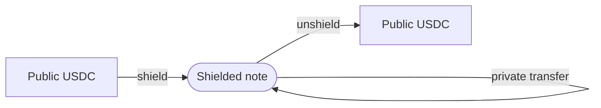

# Core flows

Everything Armada does is an operation on **notes** — the private records of value inside the pool
(see [Core concepts](/guide/concepts)). A unit of value starts as public USDC, is **shielded** into
a note, moves privately as notes are spent and recreated, and is eventually **unshielded** back to
public USDC.

| Operation | What it does | Protocol fee | What's visible on-chain |
|---|---|---|---|
| **Shield** | Public USDC → a shielded note | Shield fee | The deposit amount |
| **Private transfer** | Move value between notes inside the pool | Free | Nothing |
| **Unshield** | A shielded note → public USDC | Free | The withdrawn amount + recipient |
| **[Shielded yield](/flows/shielded-yield)** | Earn yield on shielded value | Yield fee (on withdrawal) | The vault deposit/redeem amounts |
| **[Payments](/flows/payments)** | Send a claimable shielded payment | Built on transfer | Nothing on-chain |

A relayer may charge its own fee to submit a transaction on your behalf, separate from the protocol
fees above. A relayer is not merely a gas convenience, though: submitting through one keeps your own
funded, public address off the transaction, which is part of what preserves your privacy. See
[Fees](/fees/).

## Shield

Shielding deposits public USDC and gives you a private balance — a note (a commitment) in the pool.
It runs locally on the hub (`PrivacyPool.shield` → the Shield module) or from another chain over
CCTP (see [Cross-chain flow](/architecture/cross-chain)).

The deposit transaction itself is public — an observer can see that some address moved USDC into
the pool. What shielding buys you is that everything you do *afterward* with that value is private
and unlinkable. Shield is the one everyday operation that charges a protocol fee: the **shield fee**
(Armada's take, plus any integrator's fee — see [Fees](/fees/)). Once the note exists, it reveals
nothing about its owner or amount.

## Private transfer

A transfer moves value between participants entirely inside the pool. It spends one or more of your
notes — publishing their **nullifiers** so they can't be reused — and creates new notes for the
recipients, all in one zero-knowledge-proven transaction. No amounts, senders, or recipients are
revealed, no value leaves the pool, and there is no protocol fee.

This is where Armada's privacy is strongest. An observer sees only that some notes were spent and
some were created, with no link between them and no tie to any identity.

## Unshield

Unshielding exits the pool. You prove ownership of a note, its nullifier is published, and public
USDC is paid out to a recipient you choose — locally on the hub, or to another chain over CCTP (see
[Cross-chain flow](/architecture/cross-chain)). Unshielding is free.

An unshield reveals the withdrawn amount and the recipient — it is a public payout — but **not which
shielded note it came from.** The nullifier cannot be linked back to your commitment, so the exit is
not tied to your deposit or your in-pool history. Unshields are always available; they cannot be
paused, except during the single brief post-[wind-down](/wind-down/) emergency window.

::: tip What's public, what's private
Shielding and unshielding touch the public world, so their amounts are visible; the privacy is in
the **unlinkability** between them. Transfers in between are fully private. The
[privacy model](/crypto/privacy) covers exactly what is and isn't hidden.
:::
