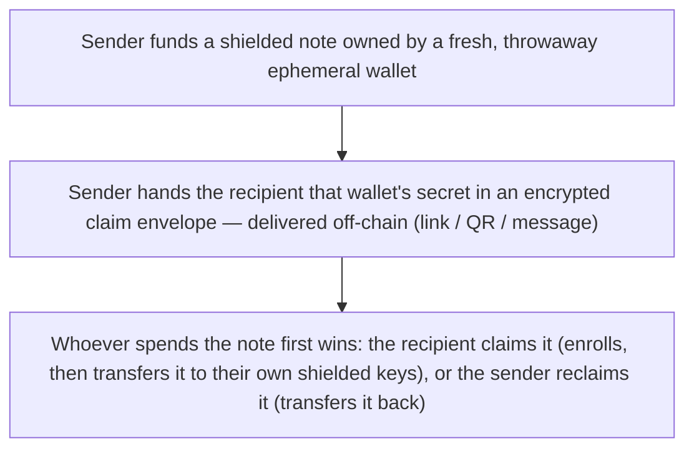

# Payments

A private transfer sends value straight to someone who already has a shielded wallet. **Claimable
payments** extend that to anyone: they let you pay an ordinary address — including someone who has
never set up shielded keys — and have them claim the funds when they're ready. Think of it as a
cheque: you write it, hand it over, and the recipient cashes it.

::: warning Planned capability
Claimable payments are **specified but not yet implemented.** The design below is what Armada
intends to ship; today only the underlying pieces exist (the ephemeral-wallet mechanism and the
in-pool transfer it builds on). The payment/claim layer in the SDK is not built yet. This page
describes the concept, not a feature you can use right now.
:::

## The problem it solves

A direct shielded transfer requires the recipient to already be **enrolled** — to have shielded
keys the sender can address. That's fine between existing users, but it can't pay someone who
hasn't set up a wallet. Claimable payments remove that requirement: you can pay any address, and the
recipient sets up their keys only at the moment they claim.

## How a claimable payment works

The mechanism reuses the primitives Armada already has:

- **The cheque is a note owned by a throwaway wallet.** The sender derives a fresh, single-use
  wallet, funds a shielded note owned by it, and delivers that wallet's secret to the recipient in
  an encrypted **claim envelope** — a link, QR code, or message passed off-chain. The envelope *is*
  the cheque; whoever holds it can spend the note.
- **Claiming is just an in-pool transfer.** To claim, the recipient enrolls (a single signature)
  and the ephemeral wallet transfers the note to the recipient's own shielded keys. Because it's a
  normal private transfer, the recipient's public address never appears on-chain.
- **The sender can reclaim.** If the payment is never claimed, the sender runs the same transfer in
  reverse and takes the funds back.
- **The pool settles any race.** If a claim and a reclaim are attempted at once, the pool's
  nullifier rule decides it atomically: the first valid spend of the note wins, and the other
  fails. There is no ambiguity about who ended up with the money.

## What it does *not* require

Claimable payments are entirely an application-layer construct built on shielding and transfers.
There is **no on-chain escrow contract**, no server holding claim codes or mapping them to
addresses, and no custody by the relayer — the relayer stays a dumb pipe that can't read the
payment. Nothing about the design needs new contract, circuit, or relayer support; it is only the
wallet/SDK software that has to be built.

When it ships, the concrete API for creating, claiming, reclaiming, and tracking payments will live
in the [SDK reference](https://sdk.armada.blue).
