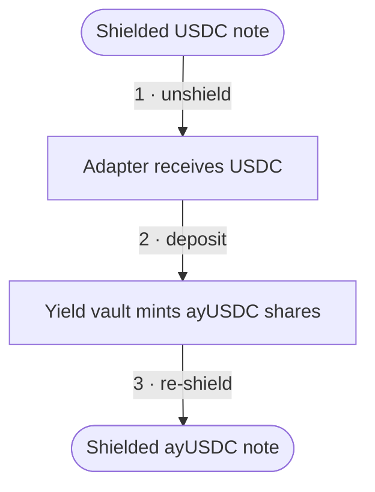

# Shielded yield

Shielded yield lets a shielded USDC balance earn yield without leaving the pool's privacy. You put
shielded USDC to work in an integrated vault and receive yield-bearing shares (**ayUSDC**) — held
as shielded notes, just like your USDC — so you earn without revealing your identity, balance, or
position.

There are two operations:

- **Lend** — shielded USDC → shielded ayUSDC.
- **Withdraw** — shielded ayUSDC → shielded USDC (principal + yield).

## How lending works

A single proven transaction does three things atomically, routed through the **yield adapter**:

Withdrawing is the mirror image: the adapter unshields your ayUSDC, redeems it from the vault for
USDC (principal plus accrued yield), and re-shields the USDC back to you — again in one transaction.

## Why it's trustless

The adapter briefly holds your funds in the clear between unshielding and re-shielding, so the
protocol makes sure it cannot misbehave:

- **The re-shield destination is bound into your proof.** Your proof commits to `adaptParams` — a
  hash of the note key and encryption data for the output you expect back. The adapter must
  re-shield to exactly that destination or the transaction reverts; it cannot send your ayUSDC (or
  your redeemed USDC) anywhere else.
- **Only the named adapter can consume the operation.** The proof also names the adapter, and the
  pool rejects the unshield if any other caller tries to pick it up.

Because the destination and the adapter are both fixed by the proof, lending and withdrawing are
trustless — the adapter is a conduit, not a custodian.

## The vault and ayUSDC

The vault issues **non-rebasing** ayUSDC shares. Your share balance stays fixed; instead, each share
becomes worth more USDC over time as yield accrues. This matters because a shielded note commits to
a fixed value — a rebasing balance that silently changed would break that commitment, so the vault
expresses yield as a rising share price rather than a growing balance.

The vault's underlying yield source is external — Aave on mainnet, with a mock standing in on
testnet. (The vault is ERC-4626-inspired but intentionally does not implement the full standard
interface; it is tailored to the shielded-note adapter pattern.)

## The yield fee

A **yield fee** is charged on **withdrawal**, and only on the **yield** — never on your principal.
It is **15%** of the accrued yield (governable), and it goes to the protocol
[treasury](/governance/). Lending itself is free, and the re-shield step does not pay a shield fee
(the adapter is an authorized contract, so it is exempt). See [Fees](/fees/) for the full fee
picture.

## What stays private, and what doesn't

Shielded yield keeps your **position** private — which shielded notes are yours, and therefore how
much you personally have deposited or earned, is never revealed. The re-shielded output is a fresh
commitment under your note key, so nothing links it to you.

What is **public**, however, is the vault activity itself: the adapter's deposit into and redemption
from the vault are ordinary on-chain transactions, so the USDC and ayUSDC **amounts** are visible,
as is the movement of funds through the adapter. An observer cannot tell *whose* position it is, but
they can see that a lend or withdraw of a given size occurred. Because these are individual
operations, a determined observer may be able to correlate a deposit and a later withdrawal by
timing and amount. Shielded yield protects identity and linkage to your other activity; it does not
hide that vault deposits and withdrawals of particular sizes are happening. The
[privacy model](/crypto/privacy) covers this boundary in full.
