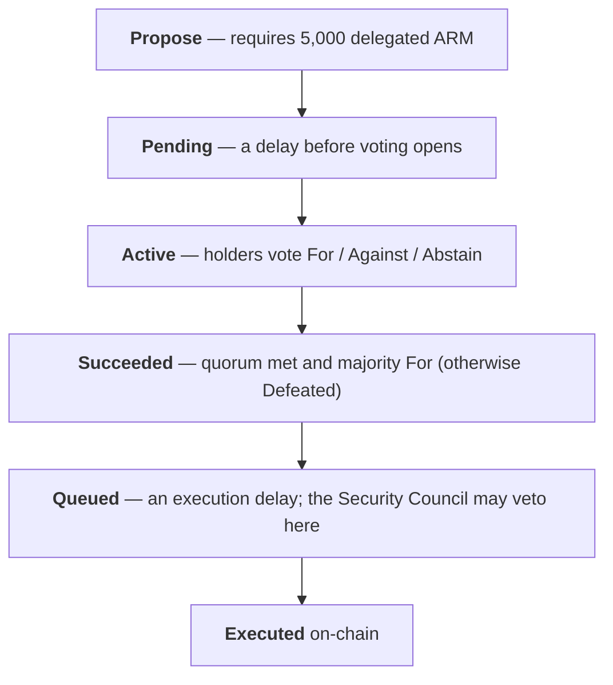

# Proposals

## The lifecycle

An executable proposal moves through a fixed set of states. Between passing and executing, it sits
in a timelock, and the [Security Council](/governance/security-council) can veto it — so a passed
proposal is never executed instantly.

To submit a proposal you need **5,000 delegated ARM** — the sole spam defense (there is no proposal
bond). A succeeded proposal must be queued within a grace period or it expires. And for a one-time
**quiet period** of 7 days after the crowdfund finalizes, no proposals can be submitted at all,
giving the protocol a moment to settle at launch.

## Proposal types

There are five kinds of proposal, differing in how long they run, how much support they require, and
whether they execute at all:

| Type | Voting period | Quorum | Execution delay | Purpose |
|---|---|---|---|---|
| **Standard** | 7 days | 20% | 2 days | Routine changes and risk-*reducing* actions |
| **Extended** | 14 days | 30% | 7 days | Risk-*increasing* / authority-granting actions — a higher bar |
| **Signaling** | 7 days | 20% | — (never executes) | Non-binding measure of community sentiment |
| **Steward** | 7 days | 20% | 2 days | Routine treasury spending by the elected steward (pass-by-default) |
| **Veto-ratification** | 7 days | 20% | — | Auto-created when the Security Council vetoes; asks holders to uphold or overturn |

Standard and Extended both have a 2-day delay before voting opens. **Steward** and
**veto-ratification** proposals are **pass-by-default** — they take effect unless the community
actively votes them down (quorum reached *and* a majority Against). This inverts the usual flow for
routine or council-triggered actions: the community only needs to act to *stop* them.

## Standard vs. Extended: tightening is easy, loosening is hard

Whether an action is Standard or Extended is decided automatically from what it does. The principle:
**actions that reduce risk or revoke authority face a lower bar than actions that expand risk or
grant authority.** Raising a fee, authorizing a new adapter, changing the Security Council, or
upgrading a contract are Extended; lowering a fee, deauthorizing an adapter, or removing the steward
are Standard. A treasury distribution above 5% of the treasury balance is automatically Extended.

::: info Implementation note
The classifier is currently **conservative**: rather than comparing a proposal's proposed value
against the current one, it routes each affected setter to a fixed tier — and where the direction is
ambiguous, it **defaults to Extended** (the higher bar). So the "tightening is cheaper" principle
holds directionally, but some tightening changes currently pay the Extended cost too. Finer,
value-aware classification is planned as a future governor upgrade.
:::
