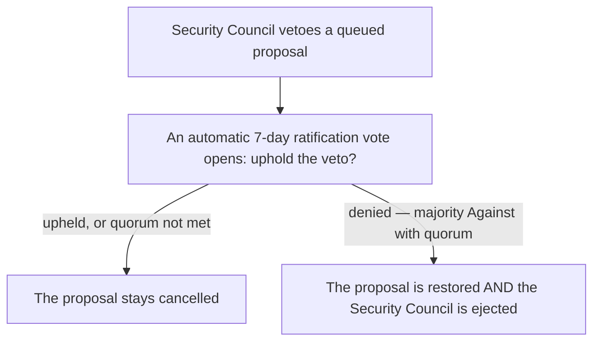

# Security Council

The Security Council is a small multisig that acts as an **emergency backstop** for situations where
the multi-day governance cycle is too slow. It is deliberately weak: it can slow things down and stop
a bad outcome, but it cannot move value or change the protocol.

## What it can do

- **Pause new shields.** The Council can halt new deposits into the pool — for example if an issue
  is suspected. The pause **auto-expires after 24 hours** and can be re-invoked, but each invocation
  is a visible on-chain event. Crucially, **unshields are never paused** — users can always exit.
- **Veto a queued proposal.** During a proposal's execution delay, the Council can cancel it before
  it executes, publishing a rationale.

That's the whole list. The Council **cannot** move treasury funds, upgrade contracts, change fees or
parameters, pause unshields, or execute arbitrary transactions.

## Veto, ratification, and ejection

A veto is not the last word — it triggers an automatic vote that holds the Council accountable:

When the Council vetoes, a **7-day ratification vote** opens asking holders to uphold the veto. If
they uphold it — or don't reach quorum — the veto stands. But if they **deny** it (a majority votes
Against, with quorum), two things happen at once: the vetoed proposal is **restored** and re-queued,
and **the Security Council is ejected** — its address is removed, and governance must elect a new one.

The ejection is the accountability mechanism. Because vetoing against the community's wishes costs
the Council its seat, it only vetoes when genuinely confident the community will agree. This replaces
the need for any separate bond or punishment. A restored proposal also can't be vetoed a second time
(the **single-veto rule**), so the Council can't use repeated vetoes to block the community's will.

## Composition and replacement

The Council manages its own signer rotation through the multisig itself, keeping routine changes off
the governance queue. Governance can replace the Council's address through an
[Extended](/governance/proposals) proposal — the path used after an ejection, or whenever the
community loses confidence in it.
