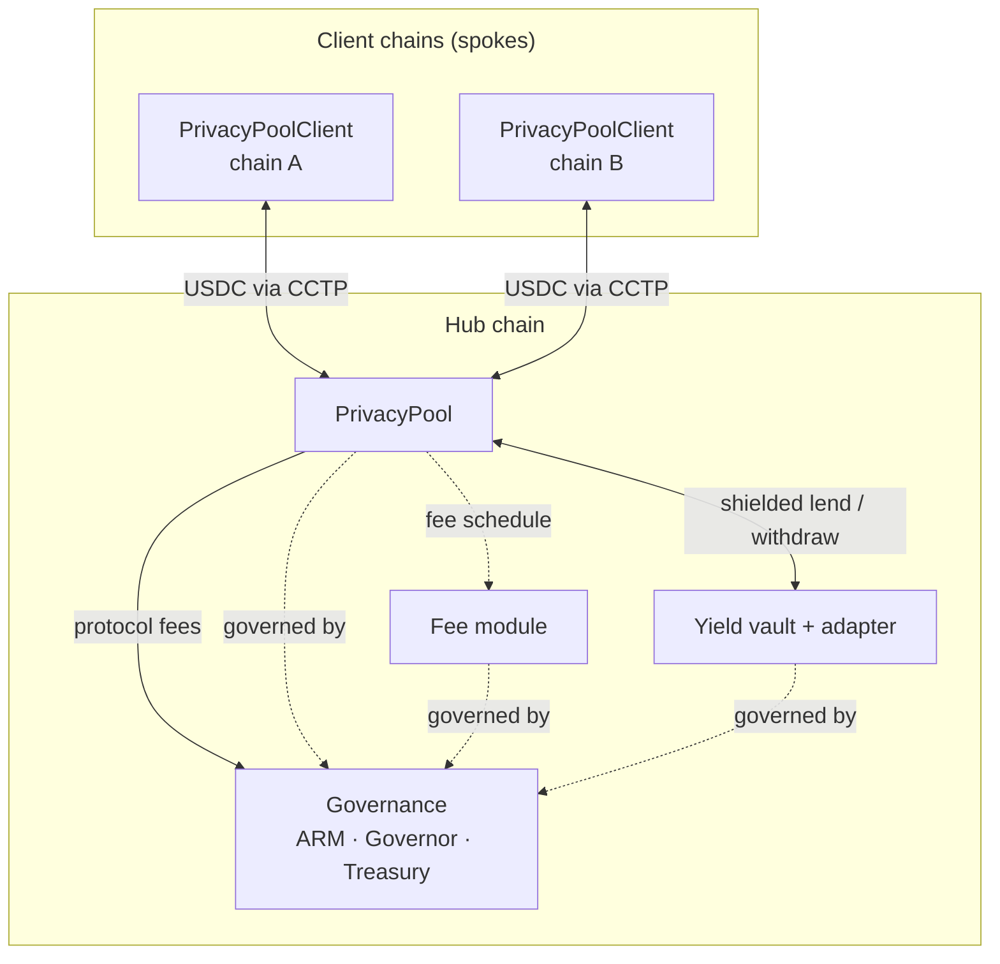

# Architecture at a glance

Armada is a **hub-and-spoke** system. One chain — the **hub** — hosts the shielded pool and all
of its private state. Every other supported chain — a **client** (or spoke) — runs only a thin
bridge contract. USDC moves between the spokes and the hub over
[CCTP](https://www.circle.com/cross-chain-transfer-protocol); privacy lives entirely on the hub.

## The moving parts

**Client chains (spokes).** Each supported chain runs a `PrivacyPoolClient` — a lightweight
bridge that burns USDC to send it to the hub (shielding) and delivers USDC received from the hub
(unshielding). It stores no private state; it is purely the on/off ramp between a chain's public
USDC and the hub's pool.

**Hub chain.** Everything private happens here:

- **PrivacyPool** — the pool itself. It holds all shielded state and routes every operation to
  four internal modules: **Shield** (deposits in), **Transact** (private transfers and
  withdrawals), **Merkle** (the commitment tree), and **Verifier** (checks the zero-knowledge
  proofs). The pool is also the contract that directly receives cross-chain USDC from the spokes.
- **Fee module** — the fee schedule the pool consults to compute protocol fees (rates, volume
  tiers, integrator terms). It computes fees; it does not hold them — the pool sends the protocol
  fee to the treasury and any integrator's share to the integrator (see [Fees](/fees/)).
- **Yield vault + adapter** — lets shielded USDC earn yield and come back into the pool without
  breaking privacy (see [Shielded yield](/flows/shielded-yield)).
- **Governance** — the ARM token, the governor, and the treasury that own and steer the
  protocol's changeable parameters, and that receives protocol fees (see
  [Governance](/governance/)).

**CCTP.** Circle's burn-and-mint transfer protocol is the transport for USDC between spokes and
the hub. It carries the value; it does not carry the private details of what happens once value
is inside the pool.

**Relayer.** A [relayer](https://github.com/ship-armada/armada-relayer) submits users'
transactions and can pay gas on their behalf, and it helps move CCTP messages between chains. It is
untrusted for safety — it cannot read or alter the private contents of a transaction — but it
matters for privacy: relaying keeps a user's own funded, public address off the transaction.
Submitting your own transactions instead links them to your address and gives up that protection.

## How the pieces come together

A typical journey through the system: USDC starts public on some chain, is **shielded** into the
pool via CCTP, moves and possibly earns yield **privately** on the hub, and is later
**unshielded** back to public USDC on whichever chain the user chooses. Governance sets the rules
around the edges — fees, authorized adapters, treasury — but cannot see into the pool or touch
its core cryptography.

The next section, [Protocol architecture](/architecture/), walks through each of these
components in depth — the module structure, the cross-chain message flow, and who controls what.
