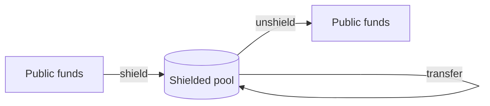

# Overview

Welcome to the Armada protocol documentation.

::: info Work in progress
This site is being scaffolded. The structure and framework are in place; the guide content is
still to be written.
:::

## What lives here

These docs cover the Armada **protocol** — its concepts and architecture, and guides for building on
it. For the TypeScript SDK's API reference, see the [SDK docs](https://sdk.armada.blue).

## Diagrams

Mermaid is enabled, so guides can embed diagrams inline:

