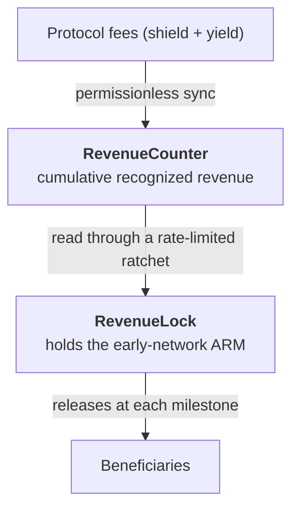

# Revenue-based unlock

The **early-network** ARM allocation — the tokens for the launch team, ecosystem contributors, and a
reserve for future contributors — does not vest on a calendar. It unlocks **in proportion to
cumulative protocol revenue.** The team's supply only becomes available if the protocol actually
earns, which ties the people building Armada to its real performance rather than to the passage of
time.

## The milestone schedule

Unlocking follows a fixed step function of cumulative recognized revenue:

| Cumulative revenue | Unlocked |
|---|---|
| $10,000 | 10% |
| $50,000 | 25% |
| $100,000 | 40% |
| $250,000 | 60% |
| $500,000 | 80% |
| $1,000,000 | 100% |

It is a **step function** — there is no interpolation between milestones (at $49,999 of revenue the
unlock is 10%; at $50,000 it jumps to 25%). And there is **no time-based fallback**: if revenue never
reaches $1M, the tokens never fully unlock. Nothing but real revenue moves the schedule forward.

## How it works

Two contracts implement this, and they are deliberately separated:

- **[RevenueCounter](/revenue/counter)** is the single, monotonic record of how much revenue the
  protocol has recognized. It's the source of truth the schedule reads.
- **[RevenueLock](/revenue/lock)** holds the early-network ARM and releases it to beneficiaries as
  milestones are reached — but it reads the counter through a **rate-limited ratchet** that caps how
  fast the observed revenue can rise, so the unlock can never lurch even if the counter were
  manipulated.

The pages that follow cover each. The important properties: revenue is recognized in a way that's
hard to fake, and the release contract is immutable — beneficiaries can trust the schedule and the
math will never change.
