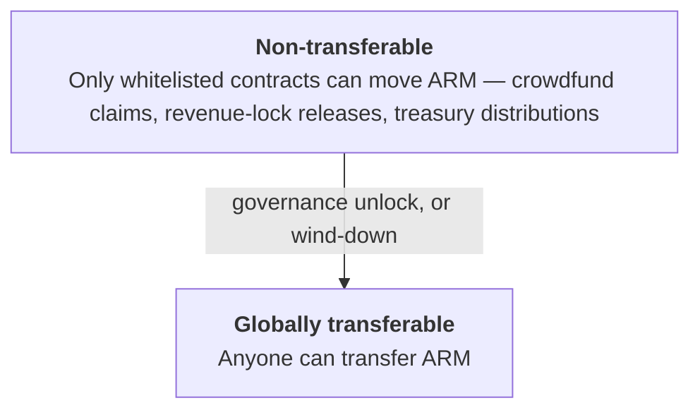

# Transfer restrictions

ARM launches **non-transferable** and becomes freely transferable only when governance decides.
Until then, it cannot be traded on the open market — but it can still be claimed, delegated, and
voted with.

## Why start non-transferable

Launching without a tradable token lets governance and distribution settle before a secondary market
forms. Holders can participate in governance from day one, while the decision to open trading is
itself left to governance rather than being baked in.

## How ARM still reaches holders

While ARM is non-transferable, the transfer rule blocks any ordinary wallet from sending it — but it
makes an exception for a small **whitelist** of protocol contracts. Those are the paths that put ARM
into holders' hands:

- **Crowdfund** — participants claim their purchased ARM.
- **Revenue-lock** — early-network tokens are released to beneficiaries as revenue milestones are met.
- **Treasury** — governance distributes ARM from the treasury.

The whitelist is **add-only** and managed by [governance](/governance/) (the timelock); there is no
way to remove an address or grant ordinary holders an exemption. So the only ARM that moves before
the global unlock is ARM flowing *out* of these distribution contracts to holders — not ARM trading
between holders.

## Unlocking transfers

ARM becomes globally transferable when it is switched on **once, irreversibly**. Two things can flip
that switch:

- **Governance** can enable transfers through a proposal — the expected path once the protocol is
  established.
- **[Wind-down](/wind-down/)** enables transfers automatically as part of shutting the protocol
  down, so holders can move ARM to claim their share of the treasury.

Once enabled, transfers can never be switched back off.

## Governance works the whole time

Non-transferability restricts *trading*, not *participation*. From launch, holders can delegate their
ARM and vote on proposals; enabling transfers later doesn't change how governance works, it only adds
the ability to trade. How voting and delegation function is covered next.
