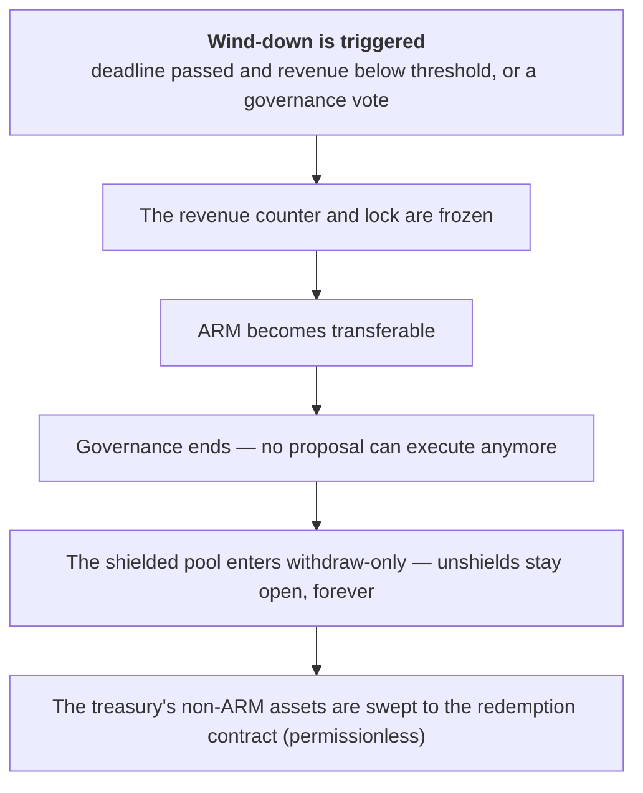

# Wind-down

Wind-down is Armada's orderly shutdown. If the protocol should stop operating — because governance
decides it should, or because it never gained enough traction — wind-down lets ARM holders exit with
a **pro-rata share of the treasury**, and lets shielded-pool users withdraw indefinitely.

It is a **termination mechanism**, not a price floor, a guaranteed return, or an arbitrage
opportunity. It provides a clean, holder-controlled exit; it doesn't promise anyone a particular
value.

## Two ways it triggers

- **Permissionless.** Anyone can trigger wind-down once two deterministic conditions are both true:
  a **deadline** has passed **and** cumulative recognized [revenue](/revenue/) is still below a
  **threshold**. Both are governance-set parameters. This is the "never gained traction" path — if
  the protocol hasn't earned enough by the deadline, no privileged actor is needed to wind it down.
- **Governance vote.** Governance can trigger wind-down without waiting for the deadline or the
  revenue condition — but only by passing an [Extended](/governance/proposals) proposal, the highest
  governance bar.

Either way, wind-down is **irreversible** — once triggered, it cannot be undone.

## What happens at the trigger

- **The revenue counter and lock freeze**, fixing the token-unlock percentages so the redemption math
  can't drift.
- **ARM becomes transferable** (if it wasn't already), so holders can move it to redeem.
- **Governance ends.** No new proposals can be created, and no pending or queued proposal can execute
  — this guarantees treasury ARM can't be moved out from under the redemption math. (Votes already in
  progress can finish, but they can never be queued or executed.)
- **The shielded pool enters withdraw-only.** New shields and in-pool transfers stop, but
  **unshields remain available indefinitely** — there is no exit window; users can always withdraw.
- **The treasury is swept.** Its non-ARM assets are moved into the redemption contract by
  permissionless calls (anyone can sweep any token); ARM itself cannot be swept and stays locked.

## Post-wind-down

After the trigger, the protocol is in a permanent terminal state. Everything left is permissionless:
holders [redeem](/wind-down/redemption) their treasury share, and shielded users unshield whenever
they want. Governance is gone; the Security Council retains only a single, non-renewable 24-hour
pause (in case an issue affects withdrawals), and nothing else.
